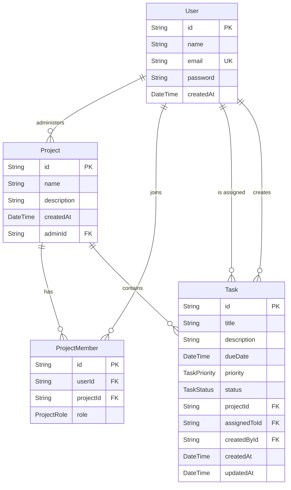

# Prisma ER Diagram

## Relationships

- `User` to `Project`: one user can administer many projects through `Project.adminId`.
- `User` to `ProjectMember`: one user can belong to many projects.
- `Project` to `ProjectMember`: one project has many members.
- `Project` to `Task`: one project contains many tasks.
- `User` to `Task` through `assignedToId`: one user can be assigned many tasks. If the assigned user is deleted, `assignedToId` is set to `NULL`.
- `User` to `Task` through `createdById`: one user can create many tasks.

## Cascading Deletes

- Deleting a project admin deletes projects administered by that user.
- Deleting a project deletes its project members and tasks.
- Deleting a user deletes their project memberships.
- Deleting an assigned user keeps the task and clears `assignedToId`.
- Deleting a task creator deletes tasks created by that user.

## Performance Indexes

- `User.email` is unique and indexed for authentication lookup.
- Project lookup is indexed by `adminId` and `createdAt`.
- Project membership lookup is indexed by `userId`, `projectId`, and `role`, with a unique constraint on `[userId, projectId]`.
- Task filtering is indexed by `projectId`, `assignedToId`, `createdById`, `status`, `priority`, `dueDate`, and `createdAt`.

## Enums

- `ProjectRole`: `ADMIN`, `MEMBER`
- `TaskPriority`: `LOW`, `MEDIUM`, `HIGH`
- `TaskStatus`: `TODO`, `IN_PROGRESS`, `DONE`
